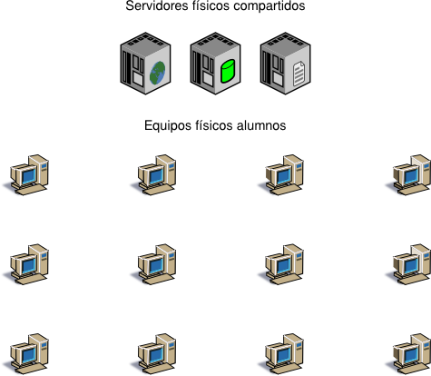
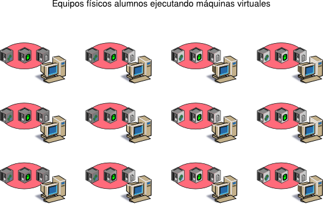
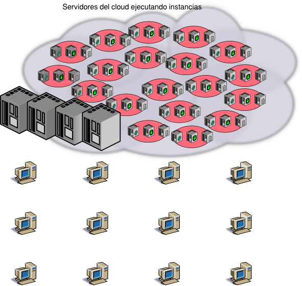

El cloud computing y en particular la capa de infraestructura no es sólo una
tecnología más que debamos aprender e incorporar al currículo de las materias
que impartimos sino que además es una poderosa herramienta didáctica.

La nube de infraestructura ofrece la posibilidad de crear escenarios completos,
poder compartirlos y modificarlos de forma sencilla y rápida y es muy adecuada
para la realización de prácticas de casi cualquier tipo. Podríamos incluso
denominar la utilización de IaaS en el aula como una herramienta de tercera
generación, siendo las dos primeras la utilización de equipos físicos y máquinas
virtuales.

## Primera fase

Utilización de equipos físicos:

* Una máquina por alumno
* Algunos servidores compartidos
* El alumno gestiona su propio equipo
* El alumno habitualmente no gestiona los servidores

Ventajas:

* Fácil despliegue inicial y puesta en marcha

Inconvenientes:

* Entorno poco versátil
* Prácticas muy limitadas por número de equipos y tipo de configuraciones
* Hardware poco variado
* Prácticas muy “académicas” enm general
* Es complicado organizar prácticas reales
* Tiempos muertos entre prácticas
* Posibles conflictos entre asignaturas

## Segunda fase

Utilización de máquinas virtuales en el equipo del alumno:

* Un equipo por alumno
* Varias máquinas virtuales por cada máquina física
* El alumno gestiona su equipo
* El alumno gestiona sus máquinas virtuales

Ventajas:

* Cada alumno dispone de un entorno "completo" e independiente
* Prácticas menos rígidas
* Es más sencillo simultanear prácticas
* Se aprende virtualización de forma transversal

Inconvenientes:

* Entorno más complejo
* Requiere equipos actualizados para los alumnos ya que la virtualización suele
ser muy exigente, sobre todo en memoria RAM
* Los alumnos tienen que administrar el gestor de máquinas virtuales

## Tercera fase

Utilización de IaaS:

* Un equipo convencional por alumno
* IaaS privado de la organización
* Los alumnos gestionan sus instancias en el cloud
* Los alumnos no gestionan el software de IaaS

Ventajas:

* Creación/uso/eliminación de instancias rápido y sencillo
* Mayor variedad de prácticas
* Fácil utilización de entornos preconfigurados
* Utilización de entornos más complejos
* Equipos básicos para los alumnos
* Aprendizaje transversal de Cloud Computing

Inconvenientes:

* Sistema muy centralizado
* Imprescindible asumir la administración del Cloud
* La inversión inicial puede ser importante
