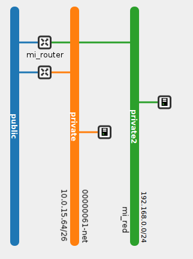
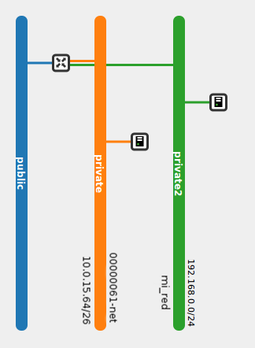

## Ejercicio 1

Crea el escenario de red que hemos explicado en las demostraciones. Comprueba que las instancias no tienen conectividad y comprueba que se puede acceder a las dos instancias después de asociarles dos ip públicas.

## Ejercicio 2

 Vamos a construir otro esquema de red, en este caso sólo vamos a trabajar con el router que viene creado por defecto. Comprueba que las dos instancias tienen conectividad y que a las dos se le puede asociar una ip pública.

## Ejercicio 3

Crea esete escenario de red, en esta ocasión tenemos las dos redes conectadas por un router. Se le puede asignar una pública a la instancia conectada a la segunda red?

## Ejercicio 4

1. Crea una instancia e instala en ella un servidor web apache2.
2. Crea un snapshot de esta instancia.
3. A partir del snapshot crea otros dos servidores webs.
4. Si quieres modifica el contenido del fichero index.html del directorio /var/www para que cada servidor muestre un mensaje distinto.
5. Configura un balanceador de carga, para balancear la carga entre los tres servidores usando el método Round Robin.

